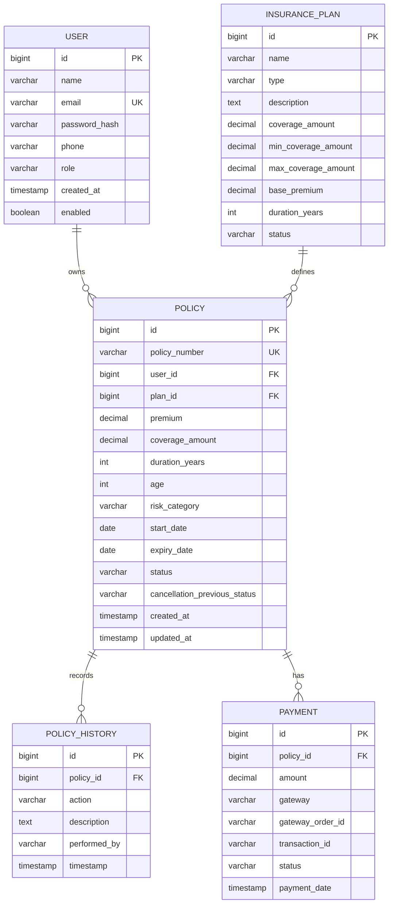

# InsureHub Database ERD

```mermaid
erDiagram
    USER ||--o{ POLICY : owns
    INSURANCE_PLAN ||--o{ POLICY : defines
    POLICY ||--o{ POLICY_HISTORY : records
    POLICY ||--o{ PAYMENT : has

    USER {
      bigint id PK
      varchar name
      varchar email UK
      varchar password_hash
      varchar phone
      varchar role
      timestamp created_at
      boolean enabled
    }
    INSURANCE_PLAN {
      bigint id PK
      varchar name
      varchar type
      text description
      decimal coverage_amount
      decimal min_coverage_amount
      decimal max_coverage_amount
      decimal base_premium
      int duration_years
      varchar status
    }
    POLICY {
      bigint id PK
      varchar policy_number UK
      bigint user_id FK
      bigint plan_id FK
      decimal premium
      decimal coverage_amount
      int duration_years
      int age
      varchar risk_category
      date start_date
      date expiry_date
      varchar status
      varchar cancellation_previous_status
      timestamp created_at
      timestamp updated_at
    }
    POLICY_HISTORY {
      bigint id PK
      bigint policy_id FK
      varchar action
      text description
      varchar performed_by
      timestamp timestamp
    }
    PAYMENT {
      bigint id PK
      bigint policy_id FK
      decimal amount
      varchar gateway
      varchar gateway_order_id
      varchar transaction_id
      varchar status
      timestamp payment_date
    }
```

Cancelled policies remain stored so the audit trail is preserved.
